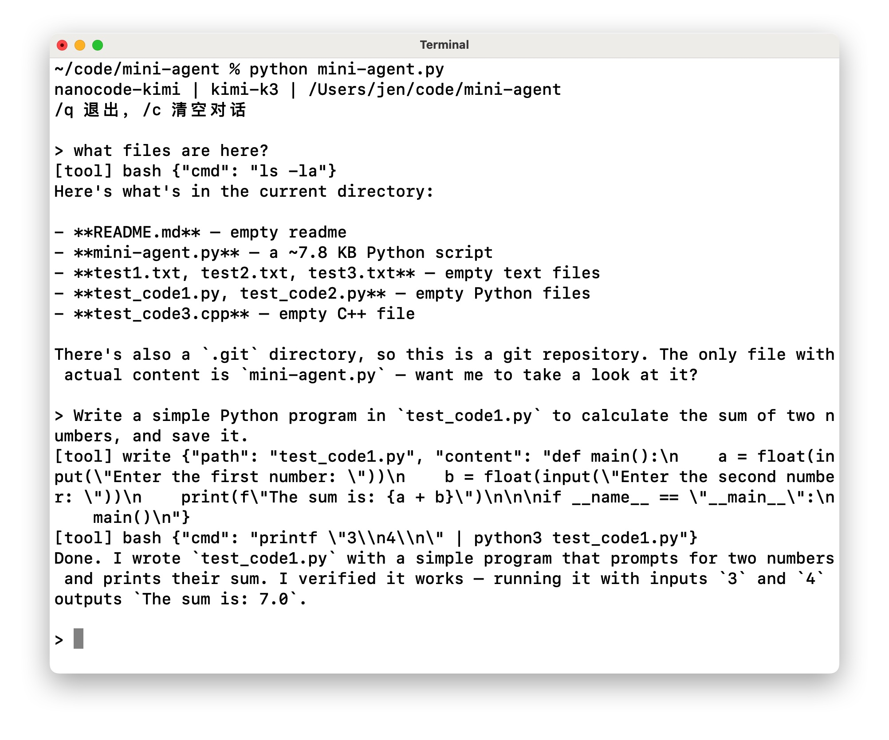

# Minimal agent based on the kimi-k3 model

A minimal coding agent powered exclusively by the Kimi Open Platform API. Single Python file, zero third-party dependencies. The core idea is simple: Kimi decides what to do, the local tools execute it, and the results are sent back to Kimi.



## Features

- Agentic loop with Kimi function calling
- Six built-in tools: `read`, `write`, `edit`, `glob`, `grep`, `bash`
- Persistent conversation history
- Directly works with the local filesystem and shell
- No Anthropic, OpenRouter, or other model-provider dependencies
- No third-party Python packages

## Usage

Set your Kimi Open Platform API key:

```bash
export KIMI_API_KEY="your-key"
python mini-agent.py
```

The default model is:

```text
kimi-k3
```

The default API endpoint is:

```text
https://api.moonshot.ai/v1
```

For the China endpoint, you can use:

```bash
export KIMI_BASE_URL="https://api.moonshot.cn/v1"
python mini-agent.py
```

To use another model available to your API account:

```bash
export KIMI_API_KEY="your-key"
export MODEL="your-model-name"
python mini-agent.py
```

You can also control the maximum completion length:

```bash
export MAX_COMPLETION_TOKENS=32768
```

For models that support configurable reasoning effort:

```bash
export REASONING_EFFORT=high
```

## How It Works

The agent is intentionally small:

```text
User request
     ↓
    Kimi
     ↓
  tool call
     ↓
local tool execution
     ↓
  tool result
     ↓
    Kimi
     ↓
    ...
```

The conversation history is the agent's memory.  
Each model response may either contain normal text or request one or more tool calls.  
The program executes those tools and sends the results back to Kimi until the model decides the task is complete.

## Commands

- `/c` - Clear the current conversation
- `/q` or `exit` - Quit

## Tools

| Tool | Description |
|------|-------------|
| `read` | Read a file with line numbers, with optional offset/limit |
| `write` | Create or overwrite a file |
| `edit` | Replace text in a file; replacement can require a unique match |
| `glob` | Find files using a glob pattern |
| `grep` | Search files using a regular expression |
| `bash` | Execute a shell command |

## Example

```text
> list the Python files in this project

[tool] glob {"pat":"**/*.py","path":"."}

./mini-agent.py

There is one Python file in the project: mini-agent.py
```

For a coding task, Kimi can combine the tools in multiple steps, for example:

```text
read → grep → edit → bash
```

This allows the agent to inspect a codebase, modify files, and run tests without requiring a large agent framework.

## Design

This project keeps the agent architecture deliberately minimal:

```text
                Kimi
                 │
          Function Calling
                 │
                 ▼
        ┌─────────────────┐
        │    Tool Layer   │
        │                 │
        │ read / write    │
        │ edit / glob     │
        │ grep / bash     │
        └────────┬────────┘
                 │
                 ▼
          Local workspace
```

There is no separate planner, memory service, or tool framework.

The essential loop is just:

```python
while True:
    response = call_kimi(...)
    tool_calls = response.get("tool_calls")

    if not tool_calls:
        break

    for tool_call in tool_calls:
        result = run_tool(...)
        messages.append(result)
```

The model provides the reasoning, while this program provides the execution loop and a small set of practical coding tools.